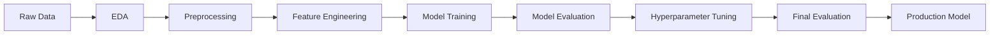

# Previsão de Vendas de Produtos Amazon

<div align="center">


**Projeto de Machine Learning para prever quantidade de produtos comprados no último mês**

</div>

---

## 📋 Descrição do Projeto

Este projeto implementa um modelo de machine learning para prever a quantidade de produtos comprados no último mês (`purchased_last_month`) utilizando dados de produtos da Amazon. O projeto utiliza **XGBoost** com hiperparâmetros otimizados através de **RandomizedSearchCV** com validação cruzada 5-fold.

### Objetivo

Desenvolver um modelo preditivo robusto que possa auxiliar em:

- 📦 Gestão de inventário
- 📊 Planejamento de demanda
- 💰 Estratégias de pricing
- 🎯 Identificação de produtos com alto potencial de vendas

---

## 🎯 Resultados Alcançados

| Métrica                  | Valor    | Descrição                                    |
| ------------------------ | -------- | -------------------------------------------- |
| **R² Score**             | 0.9133   | Modelo explica 91.33% da variância nos dados |
| **RMSE**                 | 1,688.26 | Erro médio quadrático                        |
| **MAE**                  | 338.99   | Erro absoluto médio                          |
| **sMAPE**                | 56.91%   | Erro percentual simétrico                    |
| **Melhoria vs Baseline** | 7.7%     | Redução no RMSE após tuning                  |

**Modelo Final:** XGBoost Otimizado com 19 features engineered

---

## 📊 Dataset

- **Fonte:** [Kaggle - Amazon Products Sales Dataset](https://www.kaggle.com/datasets/ikramshah512/amazon-products-sales-dataset-42k-items-2025)
- **Tamanho original:** 42,675 produtos
- **Após limpeza:** 34,140 produtos
- **Features:** 19 features após preprocessing e feature engineering
- **Divisão:** 80% treino / 20% teste

### Features Principais

- **Numéricas:** preço original, preço com desconto, rating, total de reviews
- **Categóricas:** categoria do produto, badges (Best Seller, Sponsored), cupons
- **Engineered:** discount_amount, price_ratio, rating_review_interaction, log_total_reviews

---

## 🛠️ Tecnologias Utilizadas

- **Python:** 3.12.12
- **Machine Learning:**
  - XGBoost 3.1.1
  - scikit-learn 1.7.2
  - scipy 1.16.3
- **Data Analysis:**
  - pandas 2.3.3
  - numpy 2.3.4
- **Visualização:**
  - matplotlib 3.10.7
  - seaborn 0.13.2
- **Ambiente:** conda (environment.yml fornecido)

---

## 📦 Instalação

### Pré-requisitos

- Python 3.12+
- conda (Anaconda ou Miniconda)
- Git (opcional, para clonar o repositório)

### Opção 1: Usando Conda (Recomendado)

#### Windows

```bash
# 1. Clone o repositório (ou baixe o ZIP)
git clone git@github.com:bathwaterpizza/data-science-25-2.git
cd data-science-25-2

# 2. Crie o ambiente conda
conda env create -f environment.yml

# 3. Ative o ambiente
conda activate dsproj

# 4. Verifique a instalação
python --version
python -c "import xgboost; print(f'XGBoost {xgboost.__version__}')"
```

#### macOS

```bash
# 1. Clone o repositório (ou baixe o ZIP)
git clone git@github.com:bathwaterpizza/data-science-25-2.git
cd data-science-25-2

# 2. Crie o ambiente conda
conda env create -f environment.yml

# 3. Ative o ambiente
conda activate dsproj

# 4. Verifique a instalação
python --version
python -c "import xgboost; print(f'XGBoost {xgboost.__version__}')"
```

### Opção 2: Usando pip (Alternativa)

```bash
# 1. Crie um ambiente virtual
python -m venv venv

# 2. Ative o ambiente
# Windows:
venv\Scripts\activate
# macOS/Linux:
source venv/bin/activate

# 3. Instale as dependências
pip install pandas==2.3.3 numpy==2.3.4 scikit-learn==1.7.2 xgboost==3.1.1 matplotlib==3.10.7 seaborn==0.13.2 scipy==1.16.3 jupyterlab

# 4. Verifique a instalação
python -c "import xgboost, sklearn; print('OK')"
```

---

## 🚀 Como Executar

### Exploração e Análise (Notebooks Jupyter)

```bash
# Ative o ambiente
conda activate dsproj

# Inicie o JupyterLab
jupyter lab
```

**Ordem recomendada de execução dos notebooks:**

1. `exploratory_data_analysis.ipynb` - Análise exploratória dos dados
2. `phase1_preprocessing.ipynb` - Preprocessamento e feature engineering
3. `phase2_model_training.ipynb` - Treinamento de múltiplos modelos
4. `phase3_model_evaluation.ipynb` - Avaliação inicial dos modelos
5. `phase4_hyperparameter_tuning.ipynb` - Otimização do XGBoost
6. `phase5_improved_evaluation.ipynb` - Avaliação com métricas avançadas
7. `model_performance_report.ipynb` - **Relatório final completo** ⭐

---

## 📁 Estrutura do Projeto

```
data-science-25-2/
│
├── README.md                              # Este arquivo
├── environment.yml                        # Dependências conda
├── .gitignore                            # Arquivos ignorados pelo git
│
├── amazon_products_sales_data_cleaned.csv # Dataset limpo
│
├── exploratory_data_analysis.ipynb       # Fase 0: EDA
├── phase1_preprocessing.ipynb            # Fase 1: Preprocessamento
├── phase2_model_training.ipynb           # Fase 2: Treinamento
├── phase3_model_evaluation.ipynb         # Fase 3: Avaliação inicial
├── phase4_hyperparameter_tuning.ipynb    # Fase 4: Tuning
├── phase5_improved_evaluation.ipynb      # Fase 5: Métricas avançadas
├── model_performance_report.ipynb        # 📊 Relatório Final
│
├── models/                                # Modelos treinados
│   ├── xgboost_tuned.pkl                 # 🏆 Modelo final
│   ├── best_params.pkl                   # Hiperparâmetros otimizados
│   ├── xgboost.pkl                       # Baseline
│   └── ... (outros modelos)
│
├── scaler.pkl                            # StandardScaler treinado
├── feature_names.pkl                     # Nomes das features
│
├── X_train.csv, X_test.csv              # Dados de treino/teste
├── y_train_original.csv, y_test_original.csv
│
├── model_comparison_results.csv          # Resultados comparativos
├── tuning_comparison.csv                 # Baseline vs Tuned
├── improved_metrics_results.csv          # Métricas avançadas
├── stratified_performance.csv            # Performance por segmento
│
└── *.png                                 # Visualizações geradas
```

---

## 📈 Pipeline do Projeto



### Fases Detalhadas

1. **Análise Exploratória (EDA)**

   - Análise de distribuições
   - Identificação de outliers
   - Análise de correlações
   - Identificação de missing values

2. **Preprocessamento**

   - Tratamento de missing values
   - Remoção de features irrelevantes
   - Encoding de variáveis categóricas
   - Feature engineering
   - Train/test split (80/20)

3. **Treinamento de Modelos**

   - Linear Regression
   - Ridge, Lasso, ElasticNet
   - Random Forest
   - XGBoost (melhor desempenho)
   - Gradient Boosting

4. **Hyperparameter Tuning**

   - RandomizedSearchCV
   - 5-fold cross-validation
   - 50 combinações testadas
   - Melhoria de 7.7% no RMSE

5. **Avaliação Final**
   - Métricas tradicionais: RMSE, MAE, R²
   - Métricas avançadas: sMAPE, MdAPE
   - Análise estratificada por volume
   - Feature importance
   - Learning curves

---

## 🔍 Detalhes Técnicos

### Preprocessamento

1. **Missing Values:**

   - Mediana para features numéricas
   - Flag binária para sustainability_tags
   - 'Unknown' para buy_box_availability

2. **Feature Engineering:**

   ```python
   discount_amount = original_price - discounted_price
   price_ratio = discounted_price / original_price
   rating_review_interaction = product_rating × log(total_reviews)
   log_total_reviews = log1p(total_reviews)
   ```

3. **Transformações:**
   - Log transformation para target (modelos lineares)
   - StandardScaler para features numéricas
   - One-hot encoding para categorias

### Modelo Final: XGBoost Tuned

**Hiperparâmetros Otimizados:**

- Ver arquivo `models/best_params.pkl` para detalhes completos
- Otimizado para minimizar RMSE
- Regularização L1 e L2 aplicadas

**Por que XGBoost?**

- ✅ Melhor performance entre todos os modelos
- ✅ Robusto a outliers
- ✅ Lida bem com features categóricas
- ✅ Regularização integrada previne overfitting
- ✅ Feature importance built-in

---

## 📊 Visualizações e Relatórios

### Relatório Principal

Execute o notebook `model_performance_report.ipynb` para gerar um relatório completo em português com:

- 📈 Comparação de todos os modelos
- 🎯 Resultados do hyperparameter tuning
- 📊 Métricas avançadas (sMAPE, MdAPE)
- 🔍 Feature importance
- 📉 Learning curves
- 🎨 Análise estratificada
- 📐 Residual plots

### Visualizações Geradas

- `model_comparison.png` - Comparação inicial de modelos
- `learning_curves.png` - Curvas de aprendizado
- `feature_importance_tuned.png` - Importância das features
- `metrics_comparison.png` - Comparação de métricas
- E várias outras geradas ao executar os notebooks

---

## 🎓 Insights e Aprendizados

### Features Mais Importantes

1. Interação entre rating e reviews
2. Preços e descontos
3. Categorias específicas de produtos
4. Badges promocionais

### Limitações Identificadas

- Erro percentual maior em produtos com baixo volume de vendas
- Trade-off entre RMSE e MAE após tuning
- Missing data em sustainability_tags

### Recomendações para Produção

1. **Monitoramento:**

   - Acompanhar data drift
   - Retreinar trimestralmente
   - Validar performance continuamente

2. **Melhorias Futuras:**
   - Adicionar features de sazonalidade
   - Incorporar preços de concorrentes
   - Implementar SHAP values para explicabilidade
   - Modelos específicos por categoria

---

## 🤝 Contribuindo

Contribuições são bem-vindas! Por favor:

1. Faça um fork do projeto
2. Crie uma branch para sua feature (`git checkout -b feature/NovaFeature`)
3. Commit suas mudanças (`git commit -m 'Adiciona NovaFeature'`)
4. Push para a branch (`git push origin feature/NovaFeature`)
5. Abra um Pull Request

---

## 📝 Licença

Este projeto está sob a licença MIT. Veja o arquivo `LICENSE` para mais detalhes.

---

## 👤 Autor

**Seu Nome**

- GitHub: [@bathwaterpizza](https://github.com/bathwaterpizza)
- Repositório: [data-science-25-2](https://github.com/bathwaterpizza/data-science-25-2)

---

## 📞 Contato e Suporte

- Para reportar bugs ou sugerir features, abra uma [issue](https://github.com/bathwaterpizza/data-science-25-2/issues)
- Para dúvidas sobre o projeto, consulte a documentação nos notebooks

---

## 🙏 Agradecimentos

- Dataset fornecido por [Ikram Shah no Kaggle](https://www.kaggle.com/datasets/ikramshah512/amazon-products-sales-dataset-42k-items-2025)
- Comunidade de Machine Learning e Data Science
- Bibliotecas open-source: XGBoost, scikit-learn, pandas, numpy

---

<div align="center">

**⭐ Se este projeto foi útil para você, considere dar uma estrela no repositório! ⭐**

Made with ❤️ and 🐍

</div>
